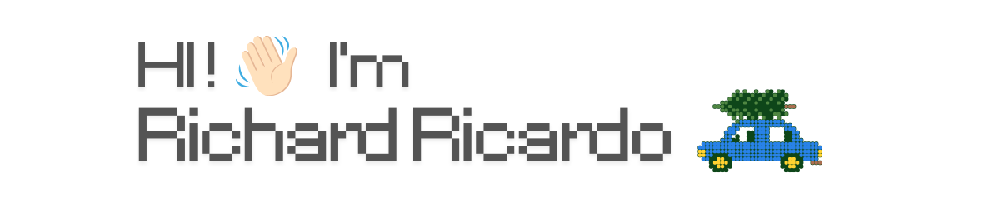

  

<h5 align="left">Full-Stack Developer focused on building SaaS products, admin dashboards, and modern web applications with Next.js and TypeScript.  I work with Prisma, Supabase, Neon PostgreSQL, Stripe, and cloud-based technologies to create scalable solutions. My interests include product development, automation, AI-powered workflows, and turning ideas into production-ready applications.</h5>

###

  
  
  
  
  
  
  
  
  
  
  
  
  
  
  
  
  

###

<h5 align="left">Explore my projects, and feel free to reach out for collaboration, opportunities, or just to connect... - https://richard-ricardo.vercel.app/   - richardricardoyohanes@gmail.com</h5>

###

  
  

###

###

  

###
